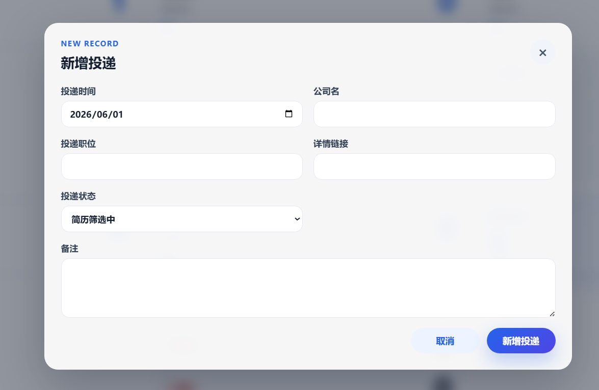
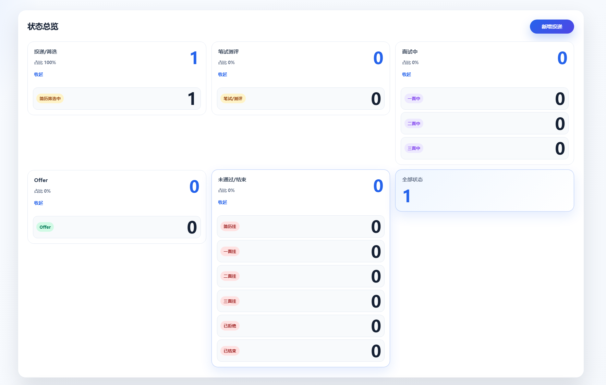
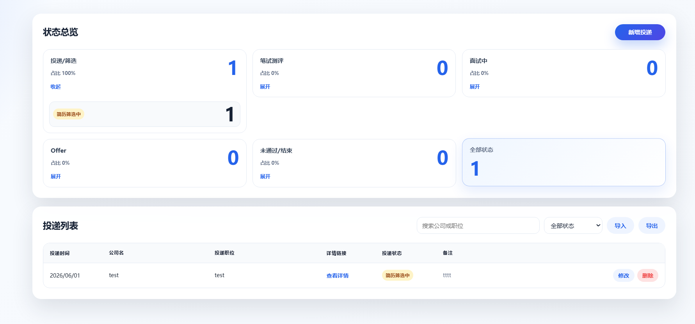

# 简历投递记录网站

## 功能介绍

- 记录投递时间、公司名、投递职位、详情链接、投递状态和备注。

  

- 支持新增、修改、删除投递记录。

- 状态总览支持按状态分组折叠查看，点击即可进行筛选。

  

- 投递列表支持搜索、按状态筛选、导入和导出 JSON 文件。

- 导入时会与现有数据合并，避免重复丢失。

  

## 技术栈

- Vue 3：使用单文件组件实现页面交互。
- Vite：提供开发服务器和前端生产构建。
- Node.js：提供静态资源服务和 JSON 文件读写接口。
- npm：管理依赖、构建脚本和 CLI 安装包。
- CSS3：负责页面布局、响应式和视觉样式。
- JSON 文件：用于持久化保存投递数据。

## 使用方式

### 本地开发

```bash
npm install
npm run dev

npm run build
npm run build:package
```

- `npm run dev` 启动 Vite 开发服务器。
- 访问终端输出的本地地址 `http://localhost:5173`。

### 安装release包

```bash
# 安装
npm install -g job-application-tracker-1.0.0.tgz
# 启动
job-application-tracker start
# 卸载
npm uninstall -g job-application-tracker
```
